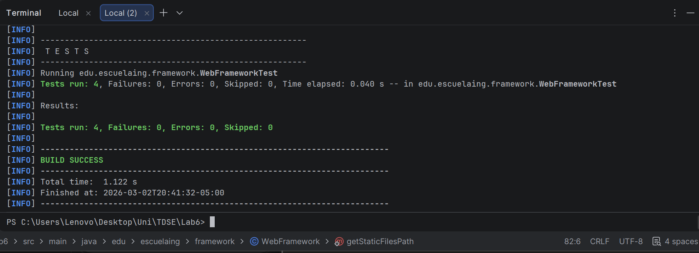
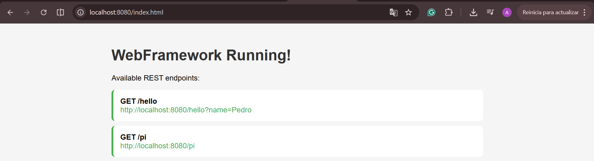
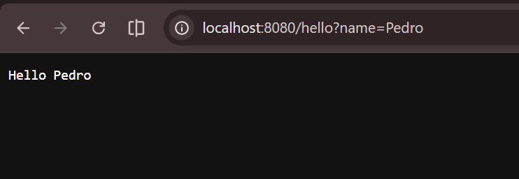
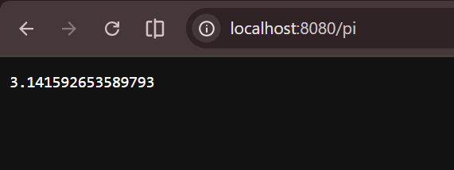

# Microframeworks WEB

Un framework web ligero en Java que permite a los desarrolladores construir aplicaciones web con servicios REST y gestión de archivos estáticos, inspirado en frameworks como Spark Java.

---

## Arquitectura

El framework está construido sobre el `HttpServer` integrado de Java y consta de tres componentes principales:

- **WebFramework** — Clase principal con los métodos estáticos `get()` y `staticfiles()`. Gestiona el registro de rutas e inicia el servidor HTTP en el puerto 8080.
- **Request** — Analiza y expone los parámetros de consulta de las solicitudes HTTP entrantes mediante `getValues(key)`.
- **Response** — Encapsula los metadatos de la respuesta HTTP como el código de estado y el tipo de contenido.

### Estructura del Proyecto

```
Microframeworks-WEB/
├── src/
│   ├── main/
│   │   ├── java/edu/escuelaing/
│   │   │   ├── framework/
│   │   │   │   ├── WebFramework.java   # Núcleo del framework
│   │   │   │   ├── Request.java        # Manejo de parámetros de consulta
│   │   │   │   └── Response.java       # Encapsulador de respuesta
│   │   │   └── app/
│   │   │       └── App.java            # Aplicación de ejemplo
│   │   └── resources/
│   │       └── webroot/
│   │           └── index.html          # Archivo estático de ejemplo
│   └── test/
│       └── java/edu/escuelaing/framework/
│           └── WebFrameworkTest.java   # Pruebas unitarias
├── pom.xml
└── README.md
```
---

## Requisitos

- Java JDK 11+
- Maven 3.6+
- Git

---

## Instalación

1. Clonar el repositorio:
```bash
git clone https://github.com/TU_USUARIO/Microframeworks-WEB.git
cd Microframeworks-WEB
```

2. Compilar el proyecto:
```bash
mvn compile
```

---

## Uso

Ejecutar el servidor:
```bash
mvn exec:java "-Dexec.mainClass=edu.escuelaing.app.App"
```

Luego abrir el navegador en `http://localhost:8080`

---

## Endpoints REST

| Método | URL | Descripción |
|--------|-----|-------------|
| GET | `/index.html` | Sirve la página HTML estática |
| GET | `/hello?name=Pedro` | Retorna un saludo personalizado |
| GET | `/pi` | Retorna el valor de Pi |

---

## Pruebas

Ejecutar las pruebas automatizadas con:
```bash
mvn test
```

### Resultado de las pruebas



---

### Evidencia de los endpoints

**`GET /index.html` — Archivo estático**



---

**`GET /hello?name=Pedro`**



---

**`GET /pi`**


